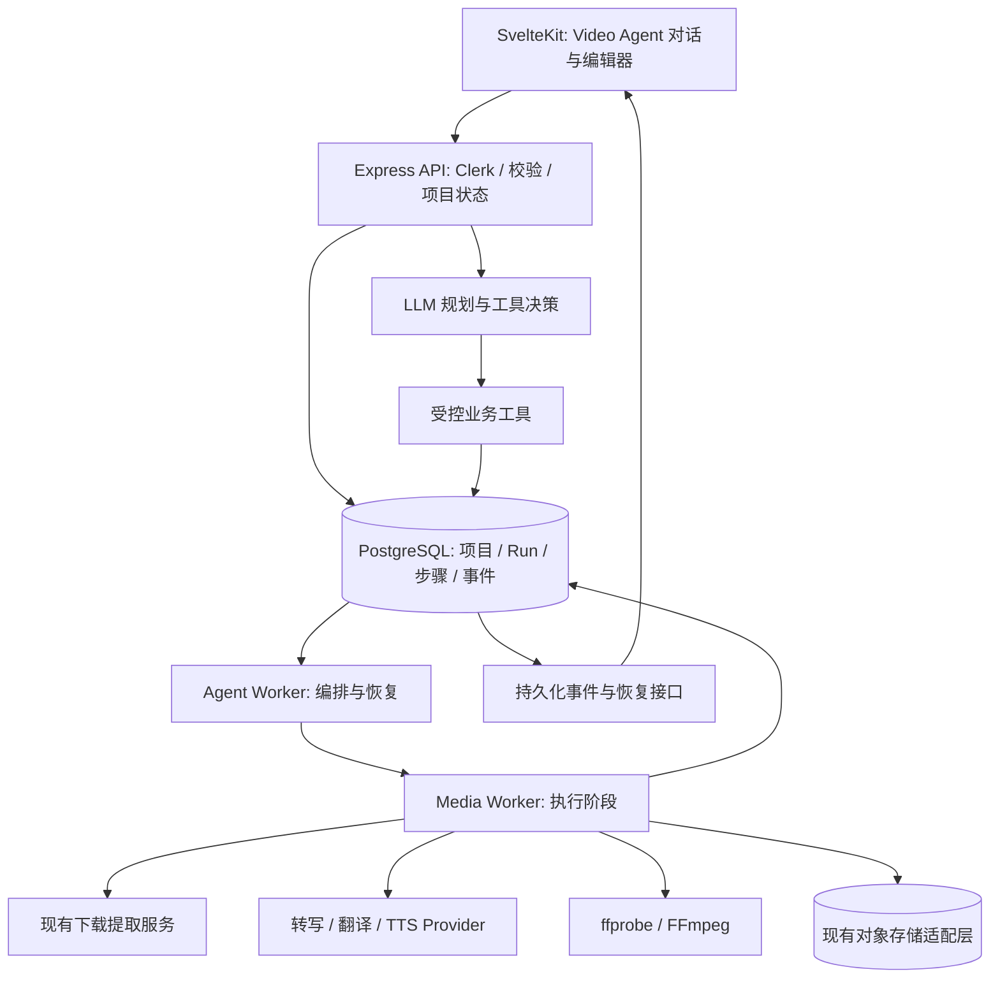

# Video Agent 详细设计

版本：v1.0；日期：2026-09-17；状态：待实施设计。

本文定义新增产品和实施任务，不代表功能已经上线。现有实现依据为 `api/src/ai-video/*`、`api/src/db/ai-video.js`、`api/src/routes/ai-video.js`、`web/src/routes/[lang]/ai-video/+page.svelte` 和侧边栏组件。

## 1. 产品决策与兼容边界

现有功能命名为 **高光剪辑（Highlight Studio）**：上传或导入视频，自动推荐精彩片段，翻译字幕，人工编辑并输出竖屏短视频。新功能命名为 **Video Agent**：用户描述目标，系统规划并执行视频处理任务，支持通过对话继续修改结果。

站点主菜单保留“AI爆款视频”入口，不增加独立 Video Agent 主菜单。进入 `/ai-video` 后，页面内部左侧子导航并列显示“高光剪辑”和“Video Agent”，使用各自页面、任务列表和交互流程。布局参考 `/console-manage-2025`，复用 PageNavSection / PageNavTab。高光剪辑保留原来的上传、分析、草稿编辑和手动渲染流程，只调整页面标题。不得把旧页面替换成聊天页，也不得迁移或隐藏旧任务。

| 项目 | 高光剪辑 | Video Agent |
| --- | --- | --- |
| 页面内子菜单名 | 高光剪辑 / Highlight Studio | Video Agent |
| 路由 | `/<lang>/ai-video`，保留现有 URL | `/<lang>/ai-video/video-agent` |
| 详情路由 | 保留当前选任务方式 | `/<lang>/ai-video/video-agent/projects/<projectId>` |
| 主交互 | 表单、草稿编辑、手动生成 | 对话、任务计划、结果与编辑面板 |
| 典型目标 | 自动提取精彩短片 | 下载、翻译、剪辑、字幕、可选配音 |
| 执行行为 | 保持现有行为 | 明确指令可自动执行和渲染 |

中文主菜单使用“AI爆款视频”，原 AI 图标保持；页面内部子菜单使用“高光剪辑”和“Video Agent”，分别使用剪刀与 AI 图标。内部侧栏宽度约 190px，左侧站点主导航保持现状。移动端“更多”菜单仍只有一个 AI 视频入口，页面内部子导航在内容上方显示。早期 `/<lang>/video-agent` 预览链接重定向至新的嵌套路由；功能开关关闭时旧链接和新路由均不可访问。

UI 支持项目已有的 de/en/es/fr/ja/ko/ru/th/vi/zh 十种语言。媒体目标语言由 Provider 能力注册表定义，与 UI 语言分别管理；现有接口接受 id，不因新增设计删除其兼容能力。

## 2. 用户目标与首版范围

主场景：输入视频链接或上传文件，再输入“下载这个视频，翻译成西班牙语，做 3 条 TikTok 短片并加字幕”。系统产出最多三个内容完整的 9:16 MP4，每条附 SRT/VTT，可继续要求“第二条缩短到 30 秒”“字幕换成双语”“改成西班牙语配音”。TikTok 是输出规格预设，不包含向平台发布。

首版能力分两次交付：

1. 首次上线：下载导入、本地上传、停顿分块、转写、精彩片段选择、上下文翻译、词级字幕对齐、竖屏渲染、对话修改、版本和恢复。
2. 配音增量：固定音色 TTS、配音时长适配、配音字幕、音轨替换与结果试听。

全片字幕翻译导出可在首次上线支持；全片重编码和全片配音放入后续版本，先验证存储、耗时与成本预算。首版不包含任意视频生成、复杂多轨编辑、声音克隆、口型同步、动态人物追踪和社交平台发布。

“翻译”默认表示字幕翻译，保留原音轨；只有明确要求配音才设置 dubbing。链接在任务中只有一个时可直接使用；没有链接或附件时请求用户提供素材；存在多个候选且未指定时询问选择。素材太短或强片段不足时返回真实数量和原因，不凑数、不复制片段。

## 3. 页面与交互

### 3.1 空状态

页面标题 Video Agent，位于 AI 视频共享页面框架中，页面内部左侧子导航始终可切回高光剪辑。说明“一句话完成视频下载、翻译、剪辑和字幕”。中心为多行输入框，支持粘贴链接、附件上传和素材选择；底部展示可用分钟额度。三个示例入口为“长视频生成 3 条短片”“生成翻译字幕”“给短片添加外语配音”。未开放的能力展示说明而不能启动。

未登录用户可输入文本，但开始执行时进入现有 Clerk 登录流程；登录后恢复输入。非会员展示现有会员权益入口。输入和规划不会触发视频分钟扣费，仍有独立请求限流。

### 3.2 项目工作区

桌面布局：项目列表约 220px；会话区域约 360–440px；右侧结果/编辑区自适应。空间不足时收起项目列表。沿用站点现有配色、字体和卡片样式，不照搬 OpenCreator UI。

工作区包括：

- 顶栏：项目名、素材、状态、额度、取消和版本选择。
- 会话区：用户消息、简短状态解释、任务计划、阶段进度、必要的补充问题。
- 结果区：预览播放器、片段卡片、标题/推荐理由、字幕、画面焦点、配音试听和下载。
- 计划卡片：目标语言、数量、时长范围、画幅、字幕模式、配音、预计消耗和执行步骤。

输入明确的执行请求后展示计划并自动开始，不增加固定的“确认计划”步骤。用户说“先给方案”时只规划；需要素材选择、缺失目标或改变收费范围时停在 awaiting_input。元数据未知时预计额度标注为预估，探测后显示实际值；超限直接阻止后续昂贵阶段。

进度由 Worker 真实状态驱动，展示“正在转写第 3/6 段”等事件，不展示模型内部思维链。HTTP 成功或任务入队只表示 accepted，不能作为视频已完成的依据。

移动端采用“对话 / 结果”两个标签，项目列表作为抽屉；编辑和下载保留完整功能。刷新或切换设备可恢复项目、会话和阶段结果。播放器签名 URL 到期时重新请求，不能触发重新渲染。

### 3.3 修改与并发

每次修改创建新配置 revision；渲染绑定不可变快照。只调整字幕样式时复用转写、片段和翻译；改变目标语言使相关翻译、配音、字幕、渲染失效；改变片段边界使该片段相关产物失效；改变音色只重做该版本配音和后续渲染。

运行期间提交后续消息进入串行队列；取消作为独立即时控制。会话和编辑器共用服务端 mutation 协议。revision 冲突返回 409 和当前 revision，前端刷新并保留未提交修改，不静默覆盖。

完成后提出修改属于新的 Run，不重新打开已完成 Run。所有版本按输入与产物关联，可回看或基于旧版本继续修改。相同修改请求重复发送只创建一次命令。

## 4. 总体架构



首版使用现有 Node API 和 Provider 风格实现受控 Agent，不把桌面 Codex CLI 作为线上用户必需依赖，不向模型暴露任意 shell。Agent 理解目标、调用业务工具、解释结果；服务端编译和校验阶段依赖；媒体 Worker 执行耗时工作。LLM 不负责轮询等待 FFmpeg，不保持长连接才能完成任务。

高光剪辑继续使用原 Worker、旧 job 表和旧流程。Video Agent 使用新表及独立 Worker deployment，复用无状态能力或新的包装适配器。共享模块发生改动时必须保持旧默认参数和输出格式。任何新算法通过 Agent 专用选项启用，旧任务不自动切换。

## 5. Agent 协议与工具

### 5.1 结构化计划

Planner 输出 strict JSON Schema；服务端追加业务校验。工具参数不因模型格式正确就自动获得授权。

```json
{
  "sourceRef": "source_uuid",
  "operation": "highlight_clips",
  "sourceLanguage": "auto",
  "targetLanguage": "es",
  "clips": { "requestedCount": 3, "minSeconds": 15, "maxSeconds": 90 },
  "video": { "aspectRatio": "9:16", "preset": "tiktok" },
  "subtitles": { "enabled": true, "mode": "translated" },
  "dubbing": { "enabled": false, "voiceId": null },
  "executionMode": "execute"
}
```

sourceRef 是服务端建立并验证归属的素材 ID。模型只输出业务目标，不输出 FFmpeg 参数、对象 key、外部抓取地址或任意代码。服务端把目标编译为 DAG，强制依赖、上限与支持能力。请求数量与实际产出分别保存。

### 5.2 工具目录

| 工具 | 输入 | 行为 |
| --- | --- | --- |
| get_project_context | projectId | 当前 revision、素材、能力、可执行操作和产物摘要 |
| inspect_source | sourceId | 入队探测，不在 API 进程处理整段视频 |
| resolve_video_source | sourceInputId | 复用现有下载提取，返回受控候选引用 |
| update_project_settings | patch | 校验并创建 revision |
| start_run | validatedPlanId | 创建 Run、阶段和额度预留记录 |
| get_run_status | runId | 真实阶段和错误摘要 |
| get_transcript_range | sourceId、时间范围 | 分页读取转写，不把整片文本放进会话 |
| update_clip | clipId、patch | 修改时间边界、标题、画面焦点 |
| update_subtitles | clipId、cue patches | 保存用户修订并标记下游失效 |
| retry_step | stepId | 从可用 checkpoint 重试失败节点 |
| list_results | runId | 返回资产引用和可下载状态 |

所有写工具采用统一 envelope：projectId、expectedRevision、idempotencyKey、input。用户归属从 Clerk 解析，不能由模型指定。工具返回 accepted/completed/needs_input/error、commandId、revision 和安全摘要。取消、删除由直接 API 提供，不依赖模型决定。

每次模型调用设置输入长度、输出 token 和超时上限；一个规划回合工具调用默认上限 12 次，格式修复最多 2 次。超过限制返回明确失败状态。取消、Provider 拒绝、预算不足不会被当作格式错误反复调用。

视频字幕、网页元数据、文件名均作为不可信素材；不能修改系统规则或扩展工具权限。会话摘要包含用户约束、选定素材、revision 和产物引用，大字幕通过范围读取，不进入每轮上下文。

## 6. 媒体 DAG 与执行策略

### 6.1 默认短片流程

`resolve/ingest → probe → chunk → transcribe → normalize → select_clips → translate_selected → build_subtitles → render → verify → publish_results`

配音插入在 translate_selected 后：`prepare_dub_text → tts → fit_dub_timeline → build_dub_subtitles → render`。

先根据源语言转写选片，再翻译选中的片段及上下文，避免只需要几条短片时翻译整片。选片所用文本仍需全文转写。全片字幕任务走 `translate_full → export_subtitles`，不执行选片和视频重编码。重新选片可复用全文转写，但新片段必须检查翻译覆盖。

### 6.2 任务状态

项目：active / archived / deleted。Run：queued / planning / awaiting_input / running / cancelling / cancelled / completed / partially_completed / failed。

步骤：pending / ready / running / retry_wait / succeeded / failed / cancelled / skipped。Run 只在所有必需输出通过验收后 completed；三个片段中两个成功则 partially_completed，保留成功结果并支持只重跑失败片段。

每个步骤保存依赖、输入快照 hash、pipelineVersion、Provider/model、attempt、checkpoint、lease、fencingToken。Worker 用 `FOR UPDATE SKIP LOCKED` 领取 ready 步骤，每 15 秒 heartbeat，初始 lease 120 秒。所有结果提交同时验证 owner、lease 和递增 fencingToken，阻止过期 Worker 覆盖新 Worker。

数据库队列为执行事实来源；内存状态不能决定已完成。阶段提交资产和 succeeded 状态在同一事务完成；资产先以 pending 登记，再上传，上传成功后注册 generation；崩溃留下的 pending 对象由清理任务处理。

429、连接中断、5xx 采用指数退避加抖动并尊重 Retry-After，单步骤默认最多 3 次尝试。缺音轨、超限、权限拒绝和无有效语音不自动重试。格式问题先修复/缩批，最终记录具体错误。自动重试和人工重试均保留 attempt 历史。

## 7. 长视频稳定性

首版沿用 1 GiB / 60 分钟上限；不能以“支持长视频”为由无限放开时长。API 上传继续使用 stream/backpressure 和顺序分块，浏览器中断后按服务端 offset 恢复。Agent 专用上传 session 不绑定旧 ai_video_jobs。

音频默认以约 600 秒为目标块长，名义切点前后约 8 秒内寻找低能量停顿；尾块不足 10 秒则合并。切点必须单调且在视频时长内，没有可用停顿时回退到合法名义切点。块的真实 startMs/endMs 和 checksum 持久化；不得继续用 index×600 推断实际偏移。

切片应按需生成和清理，限制临时磁盘；源视频、音频和渲染输出的峰值容量需在执行前预算。块大小必须小于 Provider 上传限制，并检查实际字节而非仅用码率估算。

每个转写块独立保存完整原始输出引用和规范化结果。失败只重试未成功块；全片组装时按真实偏移还原时间线。块交界进行重复文本、异常重叠和断句检查。若增加上下文重叠，则另存 processingStart/End 和 ownershipStart/End，仅归属窗口进入最终转写，按文本与时间去重。

初始媒体资源并发建议：全局渲染 1、转写 1、翻译 2、TTS 1，均可配置；不是每个项目都可单独达到该并发。旧 Worker 的资源需求保持，新增 Worker 单独配置 CPU、内存和 ephemeral-storage。增加副本前验证共享并发限流。

长片选片采取“时间窗口候选 → 全局排序/去重”：每窗 5–10 分钟及少量边界上下文，返回 segment ID 范围；服务端映射精确时间边界，再做全局筛选。目标数量只是上限，遵守 15–90 秒和内容完整性。不足时明确解释。整段转写不一次性放入 highlight prompt。

## 8. 转写和 Whisper 后处理

Provider 统一输出原文、源语言、段级时间、可选 words 和 speaker，并声明 timingCapability=word/segment。默认模型可继续采用现有配置；模型差异由 adapter 隔离，不能假设所有模型都有词级时间或稳定跨块 speaker ID。

保留原始 ASR 数据，展示字幕另行派生。处理步骤：合法时间检查 → 字词规范化 → 去重复/异常候选检查 → 基于停顿、标点和可读长度拆句 → 与原始词级时间对齐 → 生成 cue → 时间线验收。

词级模型优先使用词边界；缺少词时间时用段级与文本权重近似，并记录 timingQuality=estimated，不标称精确对齐。匹配失败不可让 LLM编造时间戳，可回退原 ASR 段、调用可选本地 alignment adapter，或要求检查。源字幕及译文共用稳定 segment/cue ID，不靠数组位置建立长期引用。

字幕配置默认每条约 1.2–3.5 秒，按语言计算字符宽度与阅读速度；极短语气词优先合并，不能仅因短而删除具有实际语义的内容。验证非空文本、起止合法、时长不越视频边界、单轨不重叠、行数/宽度合理。说话人 ID 按块命名空间保存，首版不声称已经完成跨块身份统一。

## 9. 翻译 pipeline

输入为稳定 segment ID、原文、时间范围、源/目标语言和只读上下文。准备阶段创建可编辑 glossary，保留人名、品牌和专业术语；这属于我们的新增能力，不视为 OpenCreator 已具备。

批次按 token 预算组织，初始建议正文约 2,000–4,000 tokens 并预留输出空间；前后各两句上下文只供理解，不计入翻译结果。成功批次独立保存；版本 hash 包含目标语言、原文 revision、glossary revision 和模型配置。

strict JSON Schema 后仍验证：ID 恰好覆盖当前批次、无重复或额外 ID、文本非空、数字与关键术语疑点、异常长度和阅读速度。语言/长度检查作为疑点指标，避免误判人名或短句。服务端禁止模型修改时间边界。

解析或语义失败先有限修复，再将失败批次二分；成功子批次保留，到单句仍失败则标记失败和原因。不能把原文塞进译文后宣称成功。全片字幕任务使用同一机制；选片任务只处理所需范围。

可选二次润色只修复疑点并保留原始译文版本，不能无限迭代。用户修订拥有最高优先级，Provider 重跑不得覆盖已锁定用户修订。

## 10. AI Dubbing 增量设计

首版配音以选中短片为单位，固定音色、目标语言明确。TTS adapter 提供能力、音色目录、生成、可重试错误和费用估算；生产支持实际凭证和服务条款允许的配置，不假设可无限免费调用。默认复用自有配置 Provider，不引入新的付费第三方 API 依赖。

保留 translatedText（字幕忠实译文）与 spokenText（适合时长的朗读文案）两个字段。清理音乐、掌声等非朗读标注；必要时把同说话人相邻短句合并生成音频，避免逐句机械停顿。

流程：估算时长 → 对过长文案有限压缩 → TTS → ffprobe 实测 → 时间适配 → 补静音 → 音轨组装 → 生成匹配配音的字幕。建议正常调整语速 0.9–1.15，最大允许 1.3；超过最大值必须重写/重生成或请求用户处理，不能只告警后强制加速。默认最多两次重写，不删核心语义、不改变数字与事实。

配音字幕必须对应 spokenText，并记录估算时间与实际音频关联；需要精确词级同步时进行 alignment。首版替换原音轨，明确告知原音中的背景音乐也会被替换；保留背景音需要后续 source separation 能力。speaker 标签不自动等于可用配音角色，首版默认单音色，可显式配置多角色作为后续能力。

输出保留配音试听、dub audio、dub SRT/VTT、最终 MP4 和适配报告。音频测量、最大语速、空音频、爆音/异常响度和 A/V 同步纳入验收。

## 11. 数据模型

Agent 数据使用新增表，不在旧 job 表强行加入会话状态。时间字段继续遵循项目毫秒 BIGINT，结构化快照使用 JSONB。

| 表 | 关键字段与用途 |
| --- | --- |
| video_agent_projects | id、user_id、title、status、current_revision、created_at、updated_at、deleted_at |
| video_agent_sources | id、project_id、kind、source_input_encrypted、object_key/generation、checksum、probe、status、retention_until |
| video_agent_upload_sessions | id、source_id、user_id、encrypted_storage_session、offset、size、fingerprint、expires_at |
| video_agent_messages | id、project_id、run_id、role、content、attachment_refs、client_message_id、created_at |
| video_agent_revisions | project_id、revision、parent_revision、settings_snapshot、edit_snapshot、created_by、created_at |
| video_agent_runs | id、project_id、base_revision、plan、plan_hash、status、entitlement_snapshot、budget_snapshot、created_at、completed_at |
| video_agent_steps | id、run_id、stage、scope_id、dependencies、input_hash、pipeline_version、status、attempt、checkpoint、lease_owner、lease_expires_at、fencing_token、error |
| video_agent_chunks | id、source_id、ordinal、actual_start/end、ownership_start/end、checksum、asr_config_hash、status、raw_asset_id |
| video_agent_segments | id、source_id、chunk_id、start/end、source_text、speaker_local_id、words、timing_quality、revision |
| video_agent_translations | id、segment_id、target_language、input_hash、translated_text、spoken_text、user_locked、status |
| video_agent_clips | id、project_id、revision、start/end、title、reason、score、focus_x、enabled |
| video_agent_assets | id、project_id、run_id、step_id、kind、scope_id、input_hash、object_key/generation、checksum、status、expires_at、cleanup_status |
| video_agent_commands | id、project_id、user_id、idempotency_key、payload_hash、expected_revision、receipt、status |
| video_agent_events | id、project_id、run_id、type、safe_payload、created_at |

唯一约束：project/user+client_message_id；project/user+idempotency_key；project+revision；source+ordinal+asr_config_hash；run+stage+scope+input_hash。同幂等 key 不同 payload 返回 409。队列索引按 status/available_at，资产清理按 cleanup_status/cleanup_after，事件按 project/id。

资产去重必须区分生产步骤和消费者引用：复用产物可记录 step input/output refs，删除一个 Run 不直接删仍被其他版本引用的素材。对象 key 不在对话中展示，访问通过鉴权资产接口。外部源地址加密保存并日志脱敏；不存短期签名 URL 作为永久资产标识。

## 12. API 与事件

所有接口挂在 `/user/video-agent`，采用现有 Clerk 用户解析、禁用用户检查和归属校验。成功响应区分资源返回和 202 accepted；错误沿用 status:error/error:{code,message,context} 风格。

```text
GET    /capabilities
GET    /usage
POST   /projects
GET    /projects?cursor=...
GET    /projects/:projectId
DELETE /projects/:projectId
POST   /projects/:projectId/sources
GET    /projects/:projectId/sources/:sourceId/upload
PUT    /projects/:projectId/sources/:sourceId/upload
POST   /projects/:projectId/sources/:sourceId/upload-complete
POST   /projects/:projectId/messages
GET    /projects/:projectId/messages?cursor=...
GET    /projects/:projectId/events?after=...
GET    /projects/:projectId/events/stream?after=...
POST   /projects/:projectId/commands
GET    /projects/:projectId/revisions
GET    /projects/:projectId/runs/:runId
POST   /projects/:projectId/runs/:runId/cancel
POST   /projects/:projectId/runs/:runId/retry
GET    /projects/:projectId/runs/:runId/results
GET    /projects/:projectId/assets/:assetId/download
```

上传沿用 offset、SHA-256 摘要和分块大小策略。messages POST 返回 messageId/runId/status，不阻塞等待视频；工具调用和 UI 修改通过 commands 复用同一校验引擎。

事件类型：message.created、plan.created、input.required、run.status、step.progress、artifact.ready、revision.created、usage.updated、run.completed、run.failed。事件有单调 id 和 schemaVersion，与状态更新在事务内一起写入。

前端使用带 Clerk Authorization 的 fetch 流读取 SSE，避免原生 EventSource 无法自定义鉴权头的问题；代理超时前主动重连，after 游标恢复并按 event id 去重。断线降级为轮询，终态从 Run 接口再次确认。游标超过事件保留范围时返回需重取 snapshot 的指令。

## 13. 下载复用与 Direct Bridge

自然语言中的外部 URL 先送入现有下载提取流程，不允许模型指定任意资源供 Worker fetch。单视频提取成功后创建与用户绑定的受控源引用；picker 多候选先选择，图片/纯音频不走短视频流程。

Direct Bridge 服务保持原下载行为，不能为了 Agent 自动附加 tunnelUrl。AI 处理需要把素材送入 Worker，可用受控直连 ingest；如果服务端无法获取 Direct Bridge 资源，提示用户通过浏览器/扩展下载后上传，不静默回退 tunnel。

Worker 对每次重定向执行 HTTPS、地址、DNS 和私网限制校验，限制次数、超时和流式字节数。避免校验 DNS 后用另一次未受控解析连接；实际连接地址必须受策略约束。源链接过期可重新提取一次；导入令牌消费与登记源在事务内完成，失败重试用已登记源，不再次消费 nonce。

## 14. 会员、额度与预算

初始建议：两个功能共用现有 ai_video_studio 权益和每月 120 分钟源视频处理额度，新功能增加独立 feature flag。额度周期保持当前实现的 UTC 自然月，并在 UI 明确重置时间；不改旧逻辑为另一时区。

不直接复用绑定旧 job_id 的 ai_video_usage_reservations 来记录 Agent Run。新增统一 ai_video_usage_ledger，支持 origin=highlight_studio/video_agent、operationId、sourceRevision、period、reserved/committed/released 和 consumedSeconds。上线前迁移当月旧记录，旧表继续保留；两个入口的额度查询、预留和提交均切换到同一个 ledger 适配层，原 API 响应保持。迁移期间加锁、核对汇总，不能长期分别统计两个表导致双倍额度。

预留在 probe 后、首次昂贵处理前执行；计费提交在首次转写开始时执行，沿用旧处理语义。精确同素材和 ASR 配置的复用不再次扣源分钟；素材变化或显式重新转写建立新计费操作。重试、字幕编辑和同版本重渲染不重复扣源分钟。

源分钟并不能覆盖无限翻译、配音和渲染。首版增加内部 Provider/token、TTS 字符和 render 秒数预算；单 Run 最多 5 条短片、一个目标语言、有限修改和重试，超预算提示，不擅自收取积分。建议初始每项目每日最多 10 次用户触发的渲染 Run，具体数值通过实际成本校准。配音能力上线前单独设字符/时长上限并在计划中展示。

统一用户执行锁控制两个入口合计最多一个活跃媒体任务；可保存多个项目和规划，但不能各入口各占一个运行名额。Worker 全局资源限流同样跨入口统计。旧任务创建检查和新任务预留要在相同用户 advisory lock 下完成。

已获得权益并开始的 Run 可在会员到期后完成；创建新收费 Run 再校验。输出下载按资产保留期和归属控制，不因执行期间会员到期突然失效。

## 15. 保留、清理与取消

未完成上传 6 小时、失败临时素材 24 小时、草稿与转写 30 天、输出 MP4/SRT/VTT/配音资产 7 天、签名链接 10 分钟。Agent 允许继续修改，源文件默认保留到项目最近媒体活动后 30 天，与旧任务“完成后 24 小时清理源文件”分开。

源文件保留受每用户总存储上限控制，首版建议最多 3 个保留源、总计 3 GiB；达到上限提示删除/归档旧素材或等待清理，不在用户未知时悄悄移除可编辑源。源过期后项目仍可查看历史消息和未过期结果，继续剪辑需要重新上传且校验 checksum。

取消设置 cancelling，停止领取下游步骤；Worker 检查取消并中止子进程/可中止 Provider 请求，登记清理。取消不宣称已中止供应商已计费工作；额度提交后遵循已有不自动退款规则。删除项目立即从列表隐藏并撤销后续新签名，终止 Run 后异步清理对象。已签发 URL 可能在其 10 分钟有效期内继续有效，不能承诺瞬时撤销。

项目删除和 retention 清理按对象 generation 执行，重试幂等，复用资产先检查引用。会话文本和事件需有独立保留策略：首版保留 90 天、项目删除后随清理删除；源过期不自动证明对话里已不含转写内容。

## 16. 模块与配置

建议新增：

```text
api/src/video-agent/
  capabilities.js contracts.js planner.js tools.js command-service.js
  orchestrator.js worker.js media-worker.js events.js budget.js
  stages/ingest.js probe.js chunk.js transcribe.js normalize.js
  stages/highlights.js translate.js subtitles.js tts.js render.js verify.js
api/src/db/video-agent.js
api/src/db/ai-video-usage-ledger.js
api/src/routes/video-agent.js
web/src/lib/api/video-agent.ts
web/src/components/video-agent/
  AgentComposer.svelte AgentConversation.svelte PlanCard.svelte
  ProjectList.svelte RunProgress.svelte ResultWorkspace.svelte
  ClipEditor.svelte SubtitleEditor.svelte VersionPicker.svelte
web/src/routes/[lang]/ai-video/+layout.svelte
web/src/routes/[lang]/ai-video/video-agent/+page.svelte
web/src/routes/[lang]/ai-video/video-agent/projects/[projectId]/+page.svelte
cobalt-chart/templates/video-agent-worker-deployment.yaml
```

初始环境配置：VIDEO_AGENT_ENABLED、VIDEO_AGENT_DUBBING_ENABLED、VIDEO_AGENT_PLANNER_MODEL、VIDEO_AGENT_MAX_TOOL_CALLS、VIDEO_AGENT_MAX_RUN_COST、VIDEO_AGENT_TRANSCRIBE_CONCURRENCY、VIDEO_AGENT_TRANSLATE_CONCURRENCY、VIDEO_AGENT_RENDER_CONCURRENCY、VIDEO_AGENT_SOURCE_RETENTION_DAYS。明确金额配置的单位和币种，未配置预算时拒绝启用收费能力；文本、转写和存储凭证沿用现有安全配置，不向前端下发。

LLM、ASR、翻译、TTS 分别定义 adapter，初版包装现有 Provider；停止点、重试和 checkpoint 由执行器统一管理，不重复散落在每个 adapter。FFmpeg 仅参数数组调用、windowsHide，字幕/文件名转义遵循现有实现。

## 17. 可观测性和验收

日志关联 projectId/runId/stepId/attempt/fencingToken，记录阶段耗时、块进度、Provider request id、重试和费用估算，不记录明文凭证、签名 URL 或全文字幕。指标涵盖排队时间、各阶段成功率、恢复成功率、字幕重叠数、配音超速率、临时磁盘峰值、额度差异和清理积压。

媒体验收检查真实输出文件：ffprobe 时长、1080×1920、H.264/AAC、非空、A/V 时长差、字幕时间范围和输出边界。预览首尾帧及含字幕代表帧；配音抽查实测时长和最大语速。MIME 或扩展名不能替代文件检查。

必须验证以下场景：

1. 旧入口旧任务、上传恢复、草稿编辑、手动渲染和会员响应保持。
2. 一句话从链接生成西班牙语字幕短片；配音未要求时保留原音。
3. 没素材、多候选、非法语言、额度不足和不支持服务的明确处理。
4. 46–60 分钟样本在块边界不停留重复字幕，真实偏移正确。
5. 转写第 N 块/翻译某批/某条渲染失败，仅重做失败范围。
6. JSON 包含解释、编号缺失/重复、空译文、截断和拒绝的有限恢复。
7. Worker 崩溃、lease 过期和旧 Worker 迟到提交不会产生重复完成。
8. SSE 断线重连、刷新、多标签 revision 冲突和幂等重复请求。
9. 两入口并发开始不会重复占额度或突破用户执行限制。
10. 修改目标语言/样式/音色的下游失效范围正确，用户字幕修订保留。
11. Direct Bridge 获取失败没有 tunnel 暗中回退；重定向私网被阻止。
12. 删除、源过期、结果过期与 GCS 清理保持一致，成功片段可部分返回。
13. 配音超长触发有限重写或显式失败，不能无限加速或剪掉末尾内容。

开发只运行相关 API 单元/集成测试、`pnpm -C web check` 和 i18n 检查；不运行生产 build。修改十语言文案后必须运行 `pnpm -C web i18n:check-encoding`，使用 UTF-8 与 Unicode-escape  spot check。生产构建由用户手动执行。

## 18. 实施拆分与发布

| 阶段 | 任务 | 交付门槛 |
| --- | --- | --- |
| A：产品隔离 | 保留主菜单、页面内部子导航、嵌套路由、空状态和 feature flag | 原页面流程与旧链接不变，移动端可访问两个子功能 |
| B：执行底座 | 新表、源上传、commands、Run/DAG、lease/fencing、事件、统一额度 | 幂等/恢复/并发额度测试通过，无需 LLM 也能执行合法计划 |
| C：稳定媒体 | 停顿分块、逐块 ASR、词级字幕、窗口选片、上下文翻译与缩批 | 长视频失败可恢复，时间线和真实输出验收通过 |
| D：Agent 首版 | Planner、工具、会话、结果编辑、版本与自动执行 | 目标示例完整完成，修改只重做必要步骤 |
| E：配音增量 | TTS、实测时长、语速边界、配音字幕、试听与预算 | 配音不越界，成本与时长上限可执行 |
| F：扩展 | 全片视频翻译/配音、多语言批量、背景音保留 | 按真实成本与资源压力分别评估后开放 |

先部署新表和额度兼容适配，再部署关闭入口的 API/Worker，通过内部测试后按用户 allowlist 开放。VIDEO_AGENT_ENABLED 关闭时停止接受新 Run，允许已授权运行任务安全完成；紧急暂停 Worker 使用单独运维开关。不得用同一个开关既隐藏入口又直接丢弃任务。

回滚隐藏新入口并关闭新任务受理，保留新数据与恢复能力；旧流程继续运行统一额度 ledger 兼容层，不能回滚到只统计旧表而遗失 Agent 已消耗额度。各阶段发布前记录数据库迁移与回滚兼容版本。

## 19. OpenCreator 参考与采用范围

研究基线为 OpenCreator master commit `b4d037313f5276607f8819dffb863ae2e92f43ea`。借鉴机制：共享业务状态、revision/idempotency、异步阶段、按需读取大文本、停顿切片、翻译二分回退、字幕词时间匹配和配音时间适配。

- [Agent adapter](https://github.com/krillinai/OpenCreator/blob/b4d037313f5276607f8819dffb863ae2e92f43ea/apps/daemon/src/creator/agent/codex-adapter.ts)
- [翻译模板](https://github.com/krillinai/OpenCreator/blob/b4d037313f5276607f8819dffb863ae2e92f43ea/apps/daemon/src/creator/templates/video-translation.ts)
- [停顿切片](https://github.com/krillinai/OpenCreator/blob/b4d037313f5276607f8819dffb863ae2e92f43ea/runtime/krillinai/internal/service/split_audio.go)
- [转写、翻译与后处理](https://github.com/krillinai/OpenCreator/blob/b4d037313f5276607f8819dffb863ae2e92f43ea/runtime/krillinai/internal/service/audio2subtitle.go)
- [字幕对齐](https://github.com/krillinai/OpenCreator/blob/b4d037313f5276607f8819dffb863ae2e92f43ea/runtime/krillinai/internal/service/timestamps.go)
- [配音适配](https://github.com/krillinai/OpenCreator/blob/b4d037313f5276607f8819dffb863ae2e92f43ea/runtime/krillinai/internal/service/dubbing/fit.go)

不把桌面 Runtime、Codex 登录和任意 CLI 执行照搬到线上架构；不把仅 dry-run 的 pipeline 当作可用执行入口；不继承超最大语速只告警的处理。采用思路自行实现，若后续直接引入源码或二进制，先核对根目录与 runtime 子目录许可证和依赖分发要求。

## 20. 落地任务与实施记录

| 任务 | 范围 | 状态 |
| --- | --- | --- |
| 1 | AI 视频页面内子导航、页面框架、功能开关、多语言文案 | 已实现并按页面内导航要求修正；浏览器视觉与点击验收待完成 |
| 2 | 项目、素材、上传恢复、权限与清理 | 已实现；生产 GCS 与浏览器验收待完成 |
| 3 | Run/DAG、Worker、幂等、恢复、统一额度和并发 | 待实施 |
| 4 | 长视频分块、逐块转写、词级字幕对齐 | 待实施 |
| 5 | 窗口选片、全局去重、上下文翻译与局部恢复 | 待实施 |
| 6 | 渲染验收、结果编辑、下载与版本 | 待实施 |
| 7 | Agent 对话、工具、自动执行、进度与首版上线 | 待实施 |
| 8 | TTS、配音时长适配、试听与预算 | 待实施 |

### 任务 1 实施记录（2026-09-17）

- 高光剪辑保留原 `/ai-video` 路由、API、会员权限、任务数据和处理流程；主菜单保持“AI爆款视频”和原图标，页面标题使用高光剪辑本地化名称。
- 新增 `/ai-video/video-agent` 子页面和 VideoAgentWorkspace，包含项目空状态、对话输入、视频链接、示例请求、结果空状态与计划占位。移动端可切换对话/结果。
- 按 2026-09-18 用户纠正，新增 `/ai-video/+layout.svelte`，参考管理后台构建页面内部左侧子导航；主菜单和移动端更多菜单均只有原 AI 视频入口。旧 `/video-agent` 预览链接保留重定向兼容。
- `WEB_VIDEO_AGENT_ENABLED=1` 显示入口并开放预览路由，`0` 关闭；未设置时开发环境开启、生产环境关闭。该开关仅控制前端预览，不能替代后续 API 受理和权益开关。
- 所有新增 UI 文案覆盖十种项目语言，并补齐仓库已有 id 目录，共 11 个 locale。
- 上传和执行按钮明确禁用；输入仅为当前页面内存草稿，不调用模型、创建项目或扣费。真实项目与详情页在任务 2 接入，运行状态和额度在任务 3 接入。
- 验证：`pnpm -C web check` 返回 0 错误、110 条警告（14 个既有文件）；i18n 编码、完整性检查通过，Unicode-escape 抽查和异常字符扫描通过。
- 本地浏览器预览被自动安全检查拒绝，原因是无法验证管理员策略；未绕过该检查，视觉与点击验收待完成。未执行生产 build 或部署。

### 任务 2 实施记录（2026-09-18）

- 新增独立的项目、素材、上传会话和资产表；项目列表采用时间与 UUID 组合游标，详情地址可刷新。新表初始化脚本可单独执行，接口也支持幂等初始化。
- 接口位于 `/user/video-agent`，复用 Clerk 用户解析与禁用用户检查；项目、素材、上传和下载均校验归属。项目创建不要求会员，添加素材要求现有 `ai_video_studio` 权益，不预留、不扣除处理分钟。
- 上传采用 8 MiB 分块、上传前 SHA-256 校验、6 小时会话和文件指纹；恢复时查询存储真实偏移，同一项目的写入与删除通过数据库行锁串行化。重复完成请求不会重复创建资产。
- 下载导入复用下载工具保存的加密凭证，与旧入口共用一次性 nonce；不接受任意链接作为媒体地址。下载时逐次检查 HTTPS、端口、公开 DNS 地址与重定向，并固定已验证的 DNS 地址。Direct Bridge 失败直接显示失败，不回退 tunnel。
- 新增仅负责素材导入与 ffprobe 检查的进程，不运行 LLM、字幕、TTS 或渲染。素材要求真实视频和音频流、有效尺寸与时长，最多 1 GiB / 60 分钟。检查成功记录 SHA-256、存储 generation 与媒体信息。
- 素材保留 30 天，失败文件 24 小时后清理；每用户最多保留 3 个素材 / 3 GiB。删除中及失败但尚未清理的素材继续占存储容量，避免重复上传删除绕过限制。
- 素材进程使用 SKIP LOCKED、租约续期及尝试令牌防止迟到提交；导入尝试在写对象前登记 pending 资产，进程崩溃后可回收遗留对象。最多恢复 3 次崩溃尝试；一般媒体或下载错误显示失败。
- 删除项目立即撤销 API 访问，后台先停止上传，再按 generation 清理对象，失败退避重试。独立资产清理游标不会延长下载有效期。已签发的 GCS 地址最长还有 10 分钟有效期。
- 页面接入创建、列表、详情、上传、暂停、重新选择原文件续传、导入、素材状态轮询、下载和删除。新增 30 个多语言键；执行按钮保持禁用，输入仍是临时草稿，任务 3 再接 Run/DAG 与统一额度。
- 新增 API 受理、素材进程与清理的独立 Helm 开关；关闭新受理不必停止已接收素材的处理和清理。生产默认关闭，未部署、未执行生产迁移。

验证：Video Agent 的隔离内存 PostgreSQL、HTTP、本地存储与真实 ffmpeg/ffprobe 集成测试通过，覆盖跨用户访问、会员、分块校验、丢失响应后恢复、重复完成、加密导入凭证重放、非视频文件拒绝、迟到进程、过期上传、失败清理退避与同时间游标。旧 AI 视频 infrastructure、delivery、analysis 测试通过。Svelte 检查、i18n 编码和完整性检查、Helm 模板检查通过。PGlite 测试使用单连接，不代替 GKE 多实例锁竞争验收；生产 GCS 与浏览器视觉验收未执行。未运行生产 build。

启动配置、接口清单和验收步骤见 [任务 2 运维说明](video-agent-task2.md)。
